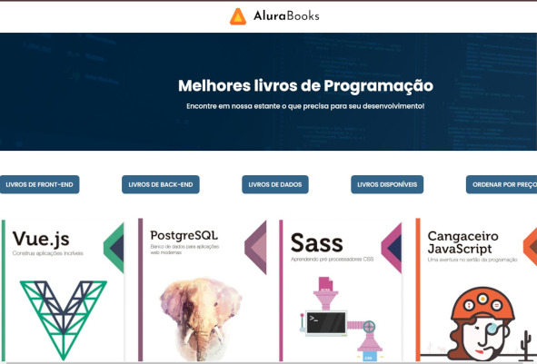

<h1 style="text-align: center">Alura Books</h1>

<h2> 📰 Sobre</h2>

Projeto do curso da Alura de Front-End, focado em JavaScript e nos métodos de array

No desafio, utilizamos um projeto do mundo real para aprender como aplicar ordenação, como aplicar filtro, como aplicar método `forEach`, `map`, `reduce`, `filter`, `sort`, e a diferença entre eles.

[forEach](materia/ForEach.md)

[map](materia/Map.md)

[reduce](materia/Reduce.md)

[filter](materia/Filter.md)

[sort](materia/Sort.md)

[Outros métodos](materia/OutrosMetodos.md)

<h2> 🚀 Tecnologias</h2>

<h2> 📞 Contato</h2>

 
  
  
   
  

